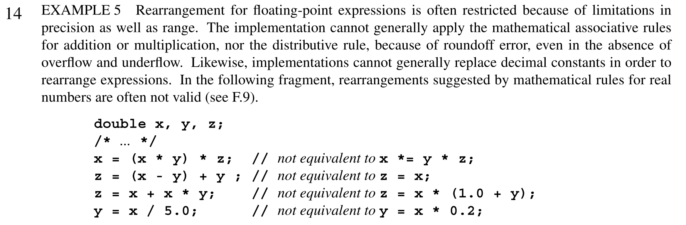

# HW1: Experiments in Vectorization
## Due: 2019-09-16 (Monday)

## Dot products

We begin by computing a dot products of vectors

```c
double dot_ref(size_t n, const double *a, const double *b) {
  double sum = 0;
  for (size_t i=0; i<n; i++)
    sum += a[i] * b[i];
  return sum;
}
```

This reference implementation has (at least) two performance bottlenecks:

1. Limited by memory bandwidth for large array sizes `n`.
2. Data dependency from one loop iteration to another.

The first cannot be overcome without fusing with surrounding context
(so the dot product is performed while memory is in cache for other
reasons), but the second can be addressed by techniques such as the
following, which relax data dependencies by reordering operations
(in this case, summing the even- and odd-indexed values separately.).

```c
double dot_opt(size_t n, const double *a, const double *b) {
  double sum0 = 0, sum1 = 0;
  for (size_t i=0; i<n; i+=2) {
    sum0 += a[i+0] * b[i+0];
    sum1 += a[i+1] * b[i+1];
  }
  return sum0 + sum1;
}
```

### Part 1: Optimizing dot product
Investigate how much performance impact this technique has.  Explain your thinking and conclusions (perhaps with data/graphs) by writing in the Jupyter notebook [`Report.ipynb`](Report.ipynb).

* Is this code correct for all values of `n`?
* Can this code change the numerically computed result?
* Can you extend this technique to increase performance further (longer vector registers and/or more instruction-level parallelism)?
* Can you make the unrolling factor `2` a compile-time constant, perhaps by using an inner loop?
* Could that factor be a run-time parameter?

### Can't the compiler do this?

The C standard does not allow floating point arithmetic to be reordered because it may change the computed values.
From C11 §5.1.2.3:

However, you may ask the compiler to attempt such optimizations anyway:
```
 -ffast-math
     Sets the options -fno-math-errno, -funsafe-math-optimizations,
     -ffinite-math-only, -fno-rounding-math, -fno-signaling-nans,
     -fcx-limited-range and -fexcess-precision=fast.

     This option causes the preprocessor macro "__FAST_MATH__" to be defined.

     This option is not turned on by any -O option besides -Ofast since it can
     result in incorrect output for programs that depend on an exact
     implementation of IEEE or ISO rules/specifications for math functions. It
     may, however, yield faster code for programs that do not require the
     guarantees of these specifications.
```
This may result in unacceptable answers in other parts of your code.

## Block inner product

Suppose we have many pairwise dot products to compute.
We could do it by looping over each combination of vector `[a0, a1, ...]` and vector `[b0, b1, ...]`, computing `dot(a0, b0)`, `dot(a0, b1)`, `dot(a1, b0)`, ...
Code for this looks like

```c
void bdot_ref(size_t n, const double *a, const double *b, double *c) {
  for (size_t j=0; j<J; j++) {
    for (size_t k=0; k<K; k++) {
      c[j*K+k] = dot_ref(n, &a[j*n], &b[k*n]);
    }
  }
}
```
You can think of this as performing the matrix product `A^T B` where `A` and `B` are tall matrices of shape `(n, J)` and `(n, K)` respectively.

### Part 2: Register a performance hypothesis

Suppose the sets are of size `J=8` and `K=4` (so you'll be computing 32 inner products in total).
Use your understanding of computer architecture and optimization to make a prediction of the best achievable performance for this operation.
Explain your rationale in `Report.ipynb` and **commit and push to your repository no later than 2019-09-13 (Friday)**.

### Part 3: What can you achieve?

Attempt to reach your performance prediction by writing your own optimized code in `bdot_opt`.
You can create multiple variants and call them from `main`.
Your optimization is allowed to change the layout in memory of the vectors `A` and `B` (see the `stride` parameters).
Explain your experiments and conclusions in `Report.ipynb`.

The following may be helpful:

* What does it mean to reorder loops?  Will it help or hurt performance?
* Does it help to change the layout in memory (see the "stride" parameters in the code)?
* Try using `#pragma omp simd` and the compiler option `-fopenmp-simd`.
* Share your techniques and results by commenting in the [GitHub repository](https://github.com/cucs-hpsc/hpsc-hw1).

* How does your achieved performance compare to your hypothesis?
* This operation can be performed by several high-performance libraries.  Consider arranging to call one of these and comparing its performance to that which you achieved and to your performance model.
  * The [DGEMM function](http://www.netlib.org/lapack/explore-html/d1/d54/group__double__blas__level3_gaeda3cbd99c8fb834a60a6412878226e1.html#gaeda3cbd99c8fb834a60a6412878226e1) in BLAS
  * The [BLIS library](https://github.com/flame/blis/)
  * The [libXSMM library](https://github.com/hfp/libxsmm/)

### Part 4: Reproducibility

Would another class member be able to read your report and reproduce your results?
Revisit parts 1 and 3 to ensure that this is indeed achievable.
In `Report.ipynb`, document any additional information that may be needed to reproduce and explain what obstacles you anticipate that may prevent reproduction.
